# 🧨 Minesweeper pe Arduino UNO R3

## Introducere

🧠 **Scopul proiectului**: Jucătorul explorează o matrice de celule, evitând bombele 💣 și marcându-le corect cu steaguri 🚩. Am pornit de la ideea jocului original de pe PC și l-am adaptat pe un sistem embedded pentru a-l face mai interactiv. Este un joc care antrenează logica și atenția, fiind în același timp o demonstrație practică a integrării hardware–software.

## Descriere generală

🎮 Proiectul constă în implementarea jocului **Minesweeper** pe un ecran LCD TFT ST7735S de 1.8” (128×160), controlat prin SPI de către un microcontroller **Arduino UNO R3**.  
👾 Jucătorul navighează o matrice 8×8 folosind un **joystick analogic**, iar cele **2 butoane fizice** permit plasarea steagurilor, opțiunea de selecție a numelui și opțiunea de a pune pe pauza/a ieși din joc.
🔊 Un **buzzer** oferă feedback auditiv la pierdere (bombă) sau câștig.

### 🧩 Schema bloc
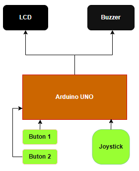

## Hardware Design

### 🔌 Bill of Materials

| Componentă                | Tip             | Cantitate | Preț / buc | Total   |
|--------------------------|------------------|-----------|------------|---------|
| Buton alb                | Buton            | 2         | 1,99 lei   | 3,98 lei |
| Buton albastru           | Buton            | 2         | 1,99 lei   | 3,98 lei |
| Joystick analogic        | Joystick         | 1         | 4,96 lei   | 4,96 lei |
| LCD TFT 1.8", 128×160    | Display SPI      | 1         | 54,99 lei  | 54,99 lei |
| Arduino UNO R3 + cablu   | Placă dezvoltare | 1         | 39,37 lei  | 39,37 lei |
| Buzzer Pasiv 5V          | Buzzer           | 1         | 1,40 lei   | 1,40 lei |
| Fire rigide              | Set              | 1         | 12,49 lei  | 12,49 lei |
| Fire tată-tată           | Set              | 4         | 2,85 lei   | 11,40 lei |
| Breadboard 400 puncte    | Breadboard       | 1         | 4,56 lei   | 4,56 lei |

### 🧩 Schema circuit
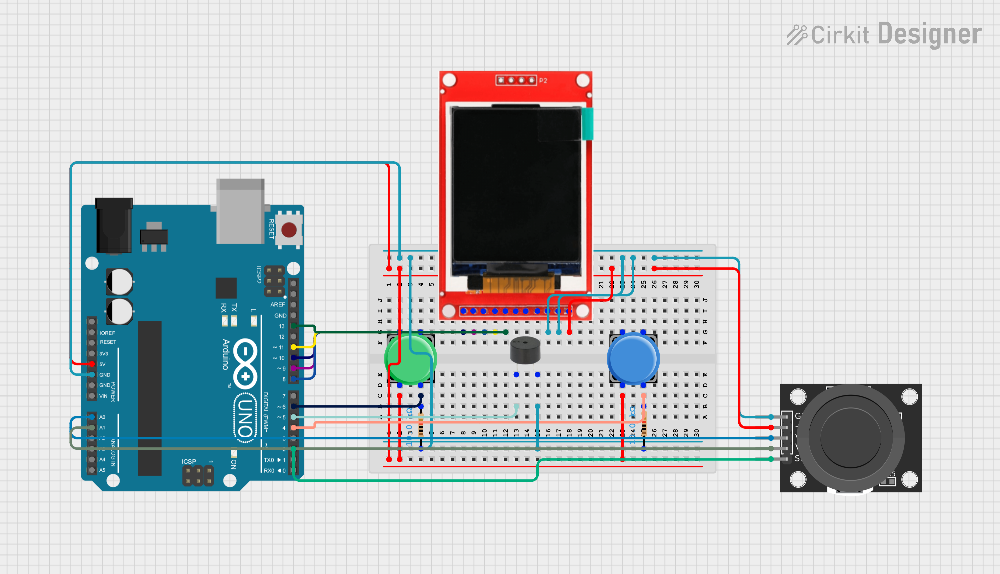

### 🔌 Conexiuni pini

| Arduino Pin   | Tip         | Conectat la                       | Note                                       |
|---------------|-------------|-----------------------------------|-------------------------------------------|
| **D10**       | Digital     | LCD CS                        | Chip-Select SPI                            |
| **D9**        | Digital     | LCD RST                       | Reset display                              |
| **D8**        | Digital     | LCD RS/DC                    | Data/Command select                        |
| **D11**       | Digital (MOSI) | LCD SDA                 | SPI MOSI                                   |
| **D13**       | Digital (SCK)  | LCD SCL                 | SPI Clock                                  |
| **5V**        | Power       | LCD VCC, Joystick VCC (+)   | +5 V alimentare                            |
| **GND**       | Power       | LCD GND , Joystick GND (–), buzzer “–” | Masă comună                           |
| **A0**        | Analog      | Joystick VRx                      | X-axis voltage                             |
| **A1**        | Analog      | Joystick VRy                      | Y-axis voltage                             |
| **D2**        | Digital     | Joystick SW                       | Switch intern joystick → când apeși conectează D2 la GND; se folosește `INPUT_PULLUP` |
| **D4**        | Digital     | Buton 1                      | Buton la +5 V, rezistor extern de pull-down (~10 kΩ) la GND                                       |
| **D6**        | Digital     | Buton 2                       | Buton la +5 V, rezistor extern de pull-down (~10 kΩ) la GND                                       |
| **D3**        | Digital / PWM | Buzzer                | Buzzer pasiv 5 V, minus la GND; poate fi modulat cu PWM |

## Project Planning

**Planificarea etapelor:**

|    ID       |    Activitate           |     Descriere          |
|-------------|-------------------------|------------------------|
|    A      |   Specificare cerințe    |   	Stabilirea cerințelor hardware/software, interfață cu joystick, afișaj TFT, butoane, buzzer   |
|    B      |  Design arhitectură    |   Împărțirea codului pe module: input (joystick/butoane), game loop, generare hartă, afișare grafică, sunet    |
|    C      |  Implementare module de bază    |   Scrierea funcțiilor de citire joystick, debounce, tone buzzer    |
|    D    |  Generare hartă și logică de joc    |      Algoritmi pentru plasarea bombardelor, flood-fill, verificare câștig/pierdere    |
|    E    |  Grafică și UI    |      Funcții drawGrid(), drawHeader(), ecran de selecție nume, splash-screen, elemente decorative (bombe, steaguri, lopate)    |
|    F    |  	Testare și optimizare    |      Măsurarea timpilor de răspuns și optimizarea redraw-ului    |
|    G    |  Documentație și prezentare    |      Redactarea README, diagrame, grafice Gantt, concluzii    |

**Relații de dependență:**
  * B → C, D, E: înainte de codul efectiv trebuie finalizat designul.
  * C → D: logica de joc se bazează pe input-ul debounced.
  * D → E: afișarea grafică și interfața necesită funcționalitatea de bază a jocului.
  * C, D, E → F: testarea și optimizarea vin după ce modulele principale sunt implementate.

## Software Design

🛠️ Proiectul a fost dezvoltat în **Arduino IDE** în limbajul **C/C++**.  
📺 Pentru grafica pe ecranul LCD ST7735S s-au utilizat:

- [`Adafruit_GFX.h`](https://github.com/adafruit/Adafruit-GFX-Library)
- [`Adafruit_ST7735.h`](https://github.com/adafruit/Adafruit-ST7735-Library)
- [`SPI.h`](https://www.arduino.cc/en/Reference/SPI)

Jocul rulează pe o matrice 8×8 în care fiecare celulă stochează starea proprie: bombă, descoperită, steag sau număr de vecini cu bombe.

   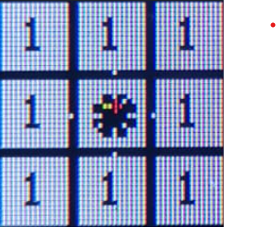
   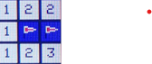

Pozițiile bombelor sunt generate aleator, iar valorile vecinilor sunt calculate automat. Utilizatorul se poate deplasa prin matrice cu joystick-ul analogic și poate interacționa prin butoane:

- **Buton 1 / SW joystick** – descoperă celule (configurat cu **pull-up intern**)
- **Buton 2** – marchează/șterge steag/confirmă numele (configurat cu rezistență de **pull-down**)
- **Buton 3** – intră în **QUIT-MENU** (configurat cu rezistență de **pull-down**)
- **Buzzer** – semnal sonor la pierdere (explozie bombă) sau la câștigare

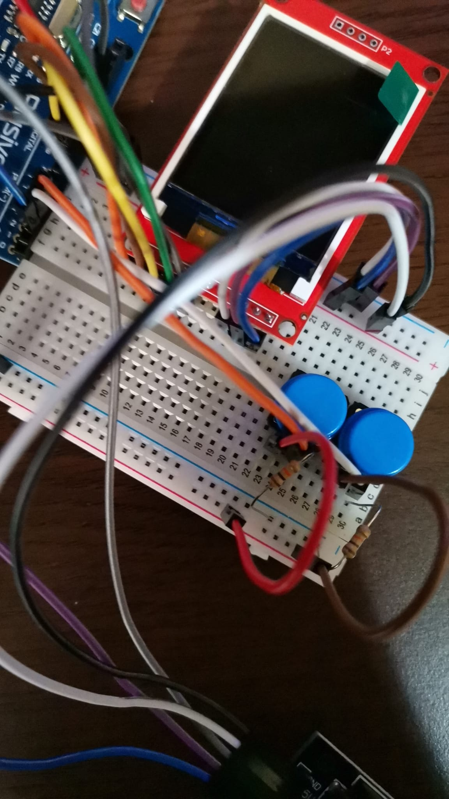

### 🔄 Funcții implementate

 * **`isButtonPressedActiveLow_PD2()`** – verifică dacă butonul conectat la pinul 2 (cu semnal activ LOW) a fost apăsat și eliberat, cu debounce intern de ~50 ms.
  * **`isButtonPressedActiveHigh_PD4/PD6()`** – verifică dacă butonul conectat la pinul 4/6 (cu semnal activ HIGH) a fost apăsat și eliberat, cu debounce intern de ~50 ms.
  * **`fastAnalogReadA0/A1()`** - verifică și citește rapid valoarea tensiunii analogice de pe pinul A0 (ADC0) / A1 (ADC1), utilizând registrele interne ale convertorului analog-digital (ADC) al microcontrollerului.
  * **`startTone()`** - activează semnalul PWM pe pinul PD3 (OC2B) cu frecvența specificată în Hz, folosind Timer2 configurat în mod CTC.
  * **`stopTone()`** - oprește semnalul PWM generat de Timer2 pe pinul PD3 și setează pinul LOW.
  * **`playBombSequence()`** – redă pe buzzer o succesiune de tonuri care indică „explozia” unei bombe (pierdere de joc).
  * **`playWinSequence()`** – redă pe buzzer o succesiune de tonuri care indică victoria în joc.
  * **`generateBoard()`** – reiniţializează matricea de joc: plasează aleator 10 bombe (valori 9) şi apoi calculează pentru fiecare celulă ne-bombă numărul de bombe din cele 8 poziţii adiacente.
  * **`flood()`** – descoperă recursiv (flood-fill) toate celulele cu valoarea 0, pornind din poziţia (r,c), şi incrementează contorul de celule descoperite.
  * **`checkWin()`** – returnează true dacă numărul de celule descoperite + numărul de bombe acoperă întreaga grilă, adică jucătorul a câştigat.
  * **`drawGrid()`** - desenează întreaga matrice 8×8 pe TFT: pentru fiecare celulă (x,y): dacă este „descoperită”, afişează fie fundal alb + număr/bombă; dacă este „ascunsă”, afişează fundal albastru + steag; apoi trasează conturul negru al celulei şi la final evidenţiază poziţia cursorului cu un contur verde.
  * **`updateScore()`** - şterge zona veche a scorului din header şi afişează noul număr de celule descoperite.
  * **`updateTimer()`** - şterge zona veche a timer-ului din header, calculează timpul rămas (MM:SS) şi îl afişează.
  * **`drawLetterGrid()`** - desenează ecranul de selectare nume: un mic header „Select Name” şi o grilă 7×4 cu literele A–Z dispuse pe rânduri.
  * **`drawHeader()`** - reîncarcă complet banda de sus a ecranului de joc.
  * **`drawBomb()`** - desenează o bombă în jurul punctului (cx,cy) cu raza R: un cerc negru conturat cu alb, opt ţepi albi pentru aspectul de explozie şi un ochi central roșu cu un fir de fitil galben.
  * **`drawFlag()`** - trasează un steag roșu într-o celulă definită de colțul (x,y) și dimensiunile date: o tijă neagră verticală și un triunghi roșu cu bordură albă în vârful acesteia.
  * **`drawCrossedPickaxes()`** - desenează două târnăcoape încrucișate centrate în jurul punctului (cx,cy), scalate de factorul size: mânere sub formă de dreptunghiuri maro, capete metalice umplute cu gri și conturate în negru, plus un accent alb care sugerează o reflexie pe lamă.
  * **`animateBombReveal()`** - animație de descoperire a bombelor atunci când calci pe una. Calculeaza pozitiile tuturor bombelor, le amestecă într-o ordine aleatoare și animăm apariția acestora.
  * **`drawSplash()`** - desenează meniul de start cu un mesaj de 'GOOD LUCK' in partea de sus, urmat de 2 optiuni "START GAME" si "SETTINGS" si randarea tarnacoapelor folosind functia **drawCrossedPickaxes()**.
  * **`drawDifficultyMenu()`** - desenează meniul de setari, mai exact dificultatea pe care o poti alege in timpul jocului. Easy care va genera doar 4 bombe, Medium cu 7 bombe si Hard cu 10 bombe.
  * **`drawConfirmQuitMenu()`** - desenează meniul de **QUIT GAME** din timpul jocului. Acest meniu prezinta 2 optiuni "No" -> continui jocul sau "Yes" -> care te duce in meniul principal.

### 📐 Funcții grafice utilizate

| Funcție         | Descriere |
|------------------|-----------|
| `fillScreen()` | Curăță tot ecranul |
| `fillRect()` | Umple un dreptunghi |
| `drawRect()` | Desenează conturul unui dreptunghi |
| `fillCircle()` | Desenează cerc solid |
| `drawCircle()` | Contur cerc |
| `drawFastHLine()` | Linie orizontală rapidă |
| `drawLine()` | Linie oblică |
| `fillTriangle()` | Triunghi solid |
| `drawTriangle()` | Contur triunghi |
| `fillRoundRect()` | Dreptunghi cu colțuri rotunjite |
| `setCursor()` | Poziționează text |
| `setTextSize()` | Setează mărimea textului |
| `setTextColor()` | Setează culoarea textului |

Logica din funcția de **loop()** constă într-un switch care jongleaza cu stările posibile:

**`enum GameState {STATE_SPLASH, STATE_SETTINGS, STATE_ENTER_NAME, STATE_PLAY, STATE_CONFIRM_QUIT};`**

  * **STATE_SPLASH** -> Starea pentru meniul principal
  * **STATE_SETTING** -> Starea pentru meniul de setări
  * **STATE_ENTER_NAME** -> Starea pentru meniul de selectare a numelui
  * **STATE_PLAY** -> Starea pentru meniul cu jocul propriu-zis
  * **STATE_CONFIRM_QUIT** -> Starea pentru meniul de **QUIT GAME**

|    Laboratoare folosite       |    Funcționalitate           |     Cod          |
|-------------------------------|------------------------------|------------------|
|    **GPIO**      |   citire / scriere de pini digitali    |   **configurePinsWithRegisters()** folosind regiștrii  |
|    **UART**      |  comunicație serială    |   Nu este explicit în cod, dar am folosit pentru afișajul în consola pentru debug    |
|    **Timere & PWM**      |  generare ton și temporizări    |   **startTone(uint16_t freq)** si **stopTone()**  folosind Timer0 pe 8 biti pentru PWM  |
|    **ADC**    |  conversie analog‐digitală    |      **fastAnalogReadA0()** și **fastAnalogReadA1()** pentru citirea poziției joystick-ului folosind regiștrii   |
|    **SPI**    |  interfațare display TFT    |      **tft.initR(INITR_BLACKTAB)** + toate comenzile **tft.xxx** folosesc **SPI** pentru comunicare cu ecranul ST7735    |

<h3 align="center">📆 Rezultate</h3>

<table align="center">
  <tr>
    <td align="center">
       
      <b>Meniu principal</b>
    </td>
    <td align="center">
      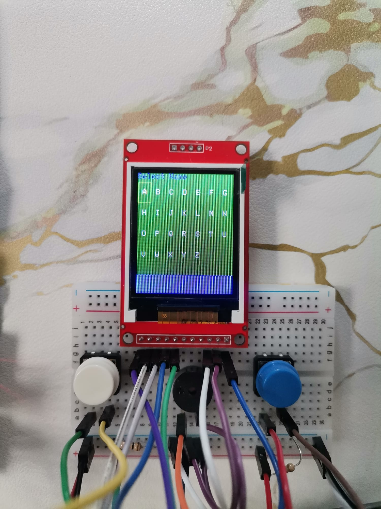 
      <b>Meniul de nume</b>
    </td>
    <td align="center">
      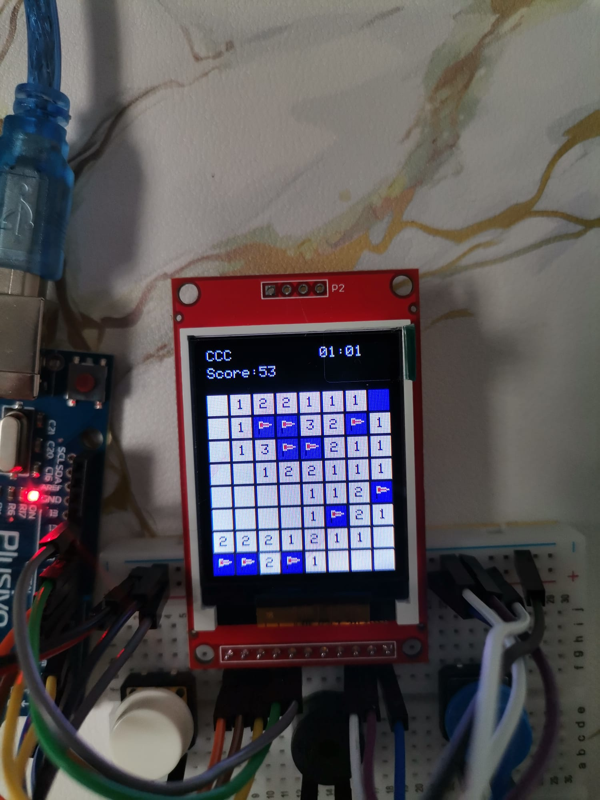 
      <b>In-game</b>
    </td>
  </tr>
  <tr>
    <td align="center">
      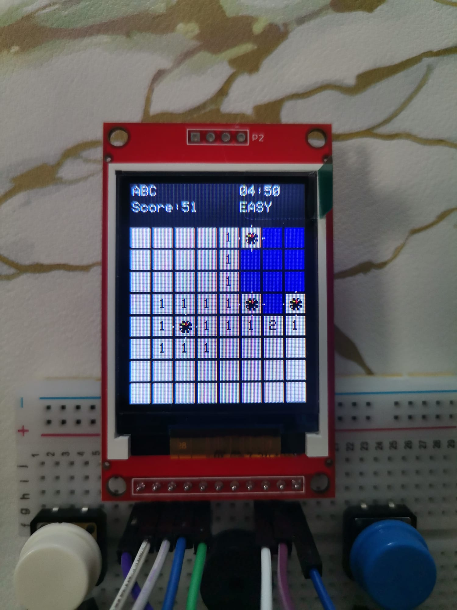 
      <b>Grafic bombă</b>
    </td>
    <td align="center">
      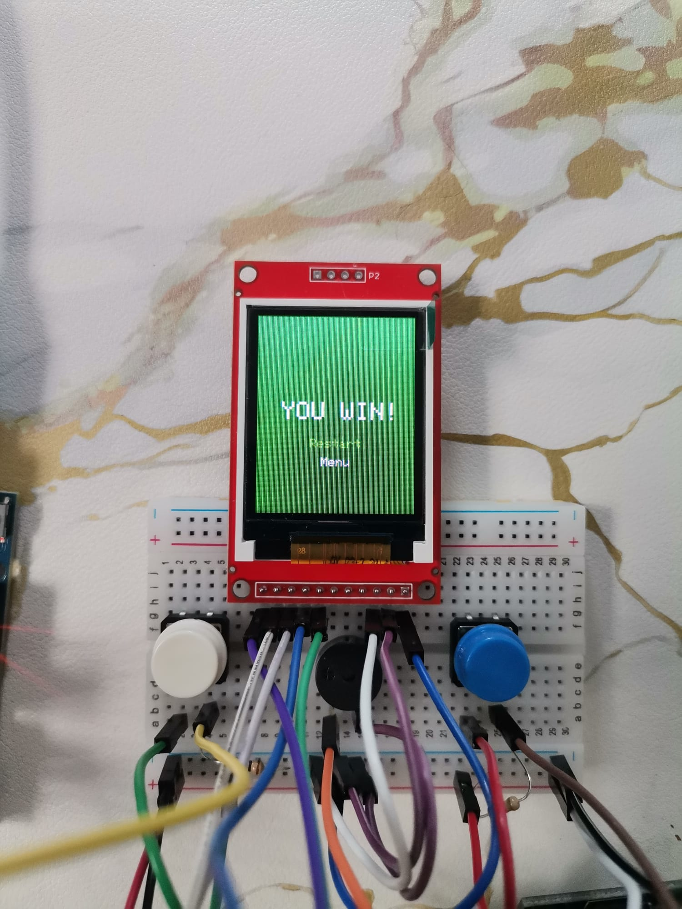 
      <b>Win</b>
    </td>
    <td align="center">
      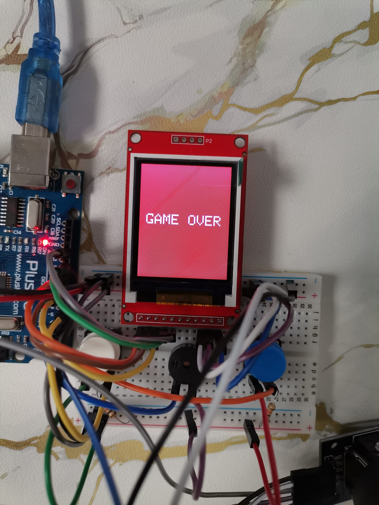 
      <b>Game Over</b>
    </td>
  </tr>
  <tr>
    <td align="center" colspan="3">
      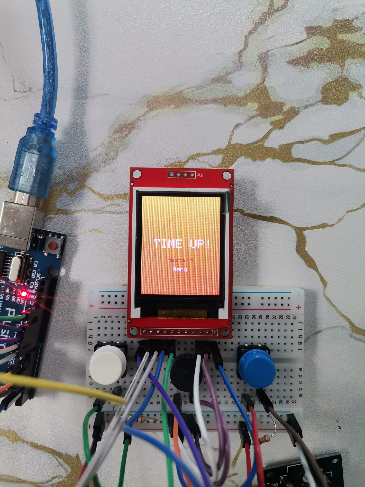 
      <b>Timp Expirat</b>
    </td>
  </tr>
</table>

## 🎥 Demo
[Vezi demo-ul Minesweeper pe YouTube Shorts](https://www.youtube.com/shorts/V5YxSL0lWsM)

## ✅ Concluzii

Proiectul Minesweeper realizat pe Arduino a fost o experiență foarte reușită și satisfăcătoare. A reușit să aducă laolaltă funcționalitatea completă a jocului, grafică interactivă și control prin joystick și butoane, toate integrate pe un ecran TFT. Faptul că totul rulează în timp real m-a ajutat să înțeleg mai bine ce înseamnă să optimizezi interfața și logica jocului pentru resurse limitate.

Mi-a plăcut în mod special partea de redare continuă a ecranului, care mi-a amintit de temele de la cursul de grafică. M-am bucurat să regăsesc acolo concepte precum bucla de render, actualizarea doar a zonelor modificate și controlul precis asupra afișajului. A fost interesant să văd cum acele noțiuni se aplică și într-un context diferit, pe un microcontroler, cu constrângeri reale de memorie și procesare.

Pe lângă partea grafică, m-a ajutat mult și pe partea de hardware: am lucrat cu pini GPIO, citirea joystick-ului prin ADC, comunicația SPI cu display-ul. Toate astea m-au făcut să înțeleg mai bine ce înseamnă să îmbini partea software cu cea hardware într-un mod funcțional și coerent.

În final, proiectul ăsta mi-a dat un plus de încredere și clar mi-a trezit interesul pentru proiecte embedded mai complexe.

## 📚 Bibliografie / Resurse

### Hardware

- [Arduino UNO R3 Datasheet](https://store.arduino.cc/products/arduino-uno-rev3)
- [ATmega328P Datasheet](https://www.microchip.com/en-us/product/ATmega328P)
- [TFT Display Guide](https://learn.adafruit.com/1-8-tft-display)
- [Joystick Guide](https://www.dfrobot.com/wiki/index.php/Analog_Joystick_Module_SKU:_DFR0061)
- [Button Guide](https://docs.arduino.cc/tutorials/generic/button)
- [Buzzer Guide](https://components101.com/buzzer)

### Software

- [Adafruit-GFX-Library](https://github.com/adafruit/Adafruit-GFX-Library)
- [Adafruit ST7735 Library](https://github.com/adafruit/Adafruit-ST7735-Library)
- [Arduino SPI Library](https://www.arduino.cc/en/Reference/SPI)
