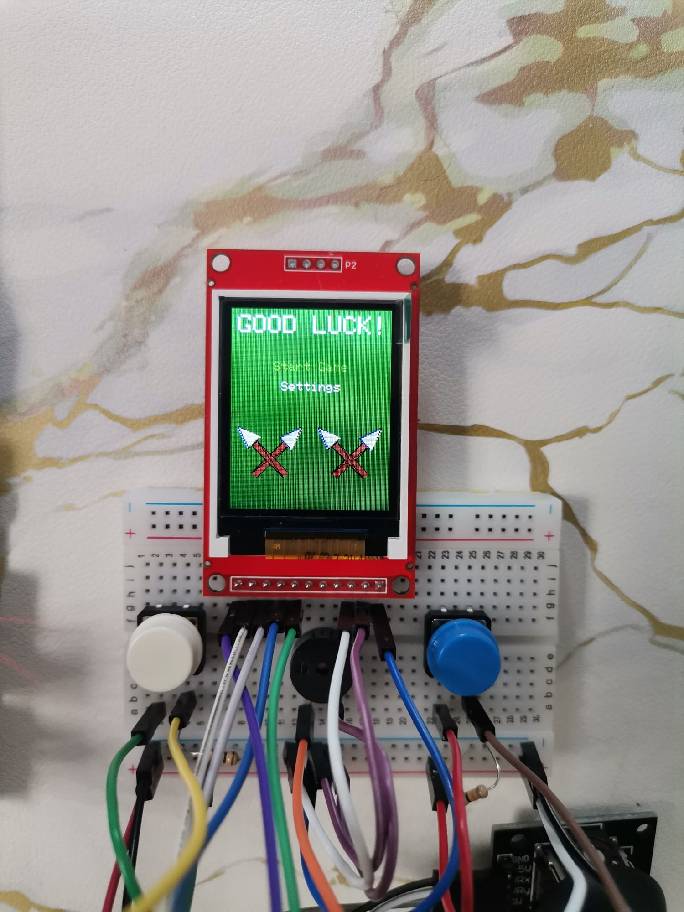
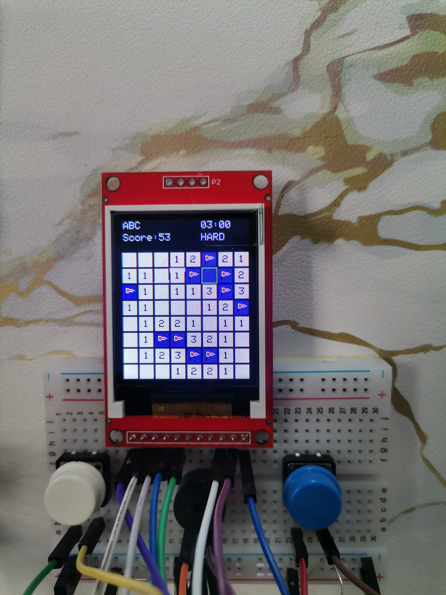
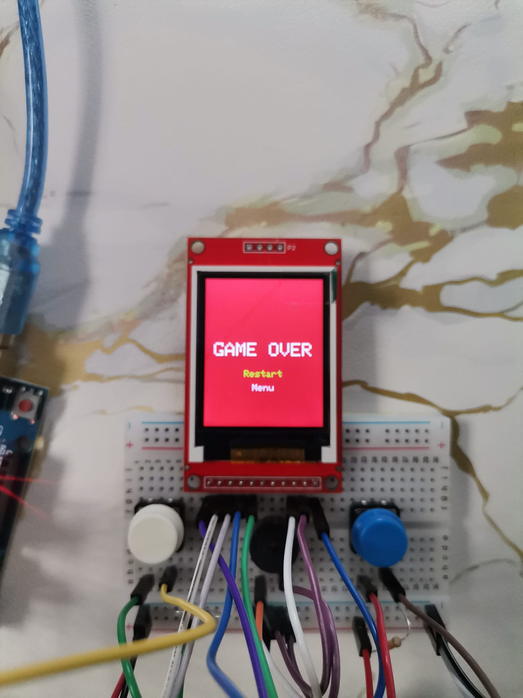

# 🧨 Minesweeper pe Arduino UNO R3

## Introducere

🧠 **Scopul proiectului**: Jucătorul explorează o matrice de celule, evitând bombele 💣 și marcându-le corect cu steaguri 🚩. Am pornit de la ideea jocului original de pe PC și l-am adaptat pe un sistem embedded pentru a-l face mai interactiv. Este un joc care antrenează logica și atenția, fiind în același timp o demonstrație practică a integrării hardware–software.

## Descriere generală

🎮 Proiectul constă în implementarea jocului **Minesweeper** pe un ecran LCD TFT ST7735S de 1.8” (128×160), controlat prin SPI de către un microcontroller **Arduino UNO R3**.  
👾 Jucătorul navighează o matrice 8×8 folosind un **joystick analogic**, iar cele **2 butoane fizice** permit plasarea steagurilor, opțiunea de selecție a numelui și opțiunea de a pune pe pauza/a ieși din joc.
🔊 Un **buzzer** oferă feedback auditiv la pierdere (bombă) sau câștig.

### 🧩 Schema bloc

## Hardware Design

### 🔌 Bill of Materials

| Componentă                | Tip             | Cantitate | Preț / buc | Total   |
|--------------------------|------------------|-----------|------------|---------|
| Buton alb                | Buton            | 2         | 1,99 lei   | 3,98 lei |
| Buton albastru           | Buton            | 2         | 1,99 lei   | 3,98 lei |
| Joystick analogic        | Joystick         | 1         | 4,96 lei   | 4,96 lei |
| LCD TFT 1.8", 128×160    | Display SPI      | 1         | 54,99 lei  | 54,99 lei |
| Arduino UNO R3 + cablu   | Placă dezvoltare | 1         | 39,37 lei  | 39,37 lei |
| Buzzer Pasiv 5V          | Buzzer           | 1         | 1,40 lei   | 1,40 lei |
| Fire rigide              | Set              | 1         | 12,49 lei  | 12,49 lei |
| Fire tată-tată           | Set              | 4         | 2,85 lei   | 11,40 lei |
| Breadboard 400 puncte    | Breadboard       | 1         | 4,56 lei   | 4,56 lei |

### 🧩 Schema circuit

## Software Design

🛠️ Proiectul a fost dezvoltat în **Arduino IDE** în limbajul **C/C++**.  
📺 Pentru grafica pe ecranul LCD ST7735S s-au utilizat:

- [`Adafruit_GFX.h`](https://github.com/adafruit/Adafruit-GFX-Library)
- [`Adafruit_ST7735.h`](https://github.com/adafruit/Adafruit-ST7735-Library)
- [`SPI.h`](https://www.arduino.cc/en/Reference/SPI)

Jocul rulează pe o matrice 8×8 în care fiecare celulă stochează starea proprie: bombă, descoperită, steag sau număr de vecini cu bombe.

Pozițiile bombelor sunt generate aleator, iar valorile vecinilor sunt calculate automat. Utilizatorul se poate deplasa prin matrice cu joystick-ul analogic și poate interacționa prin butoane:

- Buton 1 / SW joystick – descoperă celule (configurat cu **pull-up intern**)
- Buton 2 – marchează/șterge steag/confirmă numele (configurat cu rezistență de **pull-down**)
- Buton 3 – resetează jocul / confirmă numele (configurat cu rezistență de **pull-down**)
- Buzzer – semnal sonor la pierdere (explozie bombă) sau la câștigare

### 🔄 Funcții implementate

| Funcție                  | Descriere |
|--------------------------|-----------|
| `isButtonPressedActiveLow()` | Verifică apăsare buton activ LOW cu debounce |
| `isButtonPressedActiveHigh()` | Verifică apăsare buton activ HIGH cu debounce |
| `playBombSequence()` | Sunet buzzer la pierdere |
| `playWinSequence()` | Sunet buzzer la câștig |
| `generateBoard()` | Plasare bombe și calcul vecini |
| `flood()` | Descoperire recursivă celule goale |
| `checkWin()` | Verificare condiție de câștig |
| `drawGrid()` | Redare completă matrice 8x8 pe LCD |
| `updateScore()` | Actualizare scor pe ecran |
| `updateTimer()` | Actualizare timer MM:SS |
| `drawLetterGrid()` | Ecran selectare nume (grilă litere) |
| `drawHeader()` | Afișare bandă sus (scor, timp) |
| `drawBomb()` | Desen bombă grafică |
| `drawFlag()` | Desen steag într-o celulă |
| `drawCrossedPickaxes()` | Desen târnăcoape încrucișate |
| `animateBombReveal()` | Animație de reveal bombă |
| `drawSplash()` | Desen ecran START |
| `drawDifficultyMenu()` | Desen meniu **Settings** |
| `drawConfirmQuitMenu()` | Desen **QUIT-MENU** |

### 📐 Funcții grafice utilizate

| Funcție         | Descriere |
|------------------|-----------|
| `fillScreen()` | Curăță tot ecranul |
| `fillRect()` | Umple un dreptunghi |
| `drawRect()` | Desenează conturul unui dreptunghi |
| `fillCircle()` | Desenează cerc solid |
| `drawCircle()` | Contur cerc |
| `drawFastHLine()` | Linie orizontală rapidă |
| `drawLine()` | Linie oblică |
| `fillTriangle()` | Triunghi solid |
| `drawTriangle()` | Contur triunghi |
| `fillRoundRect()` | Dreptunghi cu colțuri rotunjite |
| `setCursor()` | Poziționează text |
| `setTextSize()` | Setează mărimea textului |
| `setTextColor()` | Setează culoarea textului |

<h3 align="center">📆 Rezultate</h3>

<table align="center">
  <tr>
    <td align="center">
       
      <b>Meniu principal</b>
    </td>
    <td align="center">
       
      <b>Meniul de nume</b>
    </td>
    <td align="center">
       
      <b>In-game</b>
    </td>
  </tr>
  <tr>
    <td align="center">
       
      <b>Grafic bombă</b>
    </td>
    <td align="center">
       
      <b>Win</b>
    </td>
    <td align="center">
       
      <b>Game Over</b>
    </td>
  </tr>
  <tr>
    <td align="center" colspan="3">
       
      <b>Timp Expirat</b>
    </td>
  </tr>
</table>

## 🎥 Demo
[Vezi demo-ul Minesweeper pe YouTube Shorts](https://www.youtube.com/shorts/V5YxSL0lWsM)

## ✅ Concluzii

Proiectul Minesweeper realizat pe Arduino a fost o experiență foarte reușită și satisfăcătoare. A reușit să aducă laolaltă funcționalitatea completă a jocului, grafică interactivă și control prin joystick și butoane, toate integrate pe un ecran TFT. Faptul că totul rulează în timp real m-a ajutat să înțeleg mai bine ce înseamnă să optimizezi interfața și logica jocului pentru resurse limitate.

Mi-a plăcut în mod special partea de redare continuă a ecranului, care mi-a amintit de temele de la cursul de grafică. M-am bucurat să regăsesc acolo concepte precum bucla de render, actualizarea doar a zonelor modificate și controlul precis asupra afișajului. A fost interesant să văd cum acele noțiuni se aplică și într-un context diferit, pe un microcontroler, cu constrângeri reale de memorie și procesare.

Pe lângă partea grafică, m-a ajutat mult și pe partea de hardware: am lucrat cu pini GPIO, citirea joystick-ului prin ADC, comunicația SPI cu display-ul. Toate astea m-au făcut să înțeleg mai bine ce înseamnă să îmbini partea software cu cea hardware într-un mod funcțional și coerent.

În final, proiectul ăsta mi-a dat un plus de încredere și clar mi-a trezit interesul pentru proiecte embedded mai complexe.

## 📚 Bibliografie / Resurse

### Hardware

- [Arduino UNO R3 Datasheet](https://store.arduino.cc/products/arduino-uno-rev3)
- [ATmega328P Datasheet](https://www.microchip.com/en-us/product/ATmega328P)
- [TFT Display Guide](https://learn.adafruit.com/1-8-tft-display)
- [Joystick Guide](https://www.dfrobot.com/wiki/index.php/Analog_Joystick_Module_SKU:_DFR0061)
- [Button Guide](https://docs.arduino.cc/tutorials/generic/button)
- [Buzzer Guide](https://components101.com/buzzer)

### Software

- [Adafruit-GFX-Library](https://github.com/adafruit/Adafruit-GFX-Library)
- [Adafruit ST7735 Library](https://github.com/adafruit/Adafruit-ST7735-Library)
- [Arduino SPI Library](https://www.arduino.cc/en/Reference/SPI)
